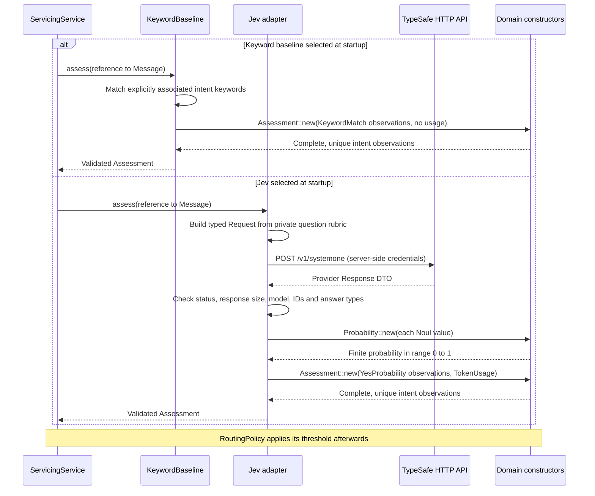

# Development setup

## Rust environment

Install Rust through [rustup](https://rustup.rs/). The repository pins its compiler
and required formatting/lint components in rust-toolchain.toml. Rustup may download
that toolchain the first time a Rust command runs in this checkout.

```sh
rustc --version
cargo --version
cargo fmt --version
cargo clippy --version
```

Use rust-analyzer in your editor if desired; it is not a project dependency.
Axum/Tokio are selected for the HTTP server; wiremock is selected for provider
HTTP tests. Axum, Tokio, Serde, and the Tower test utilities are now used;
wiremock now exercises the Jev HTTP adapter with dummy keys and local responses.

## Repository hygiene

Track the existing Cargo.lock. Ignore generated
target/coverage files and local .env files. Only sanitized .env.example content
may be committed; ignore rules are not secret scanning.
Never put API keys or real claim narratives in fixtures or telemetry.

The library exposes an HTTP router and the `api` binary serves it locally.
The serving application delegates synthetic servicing messages to a bounded
Rust coordinator and selectable Code/Jev assessors. See the root README for local
`.env` setup and the comparison UI. No consequential actions are implemented.
Configured lints forbid project unsafe code and reject unwrap/expect.
The Rust CI workflow repeats checks; its hosted result must pass before the first
behavioral slice is accepted. Use the [candidate-review runbook](candidate-review.md)
for independent review and dependency-advisory checks.
Feature combinations and dependency
policy will be defined against the actual project rather than guessed now.

## Hooks and learning

The repository-managed native Git hook invokes Cargo and npm directly. It needs
only Bash, Git and the existing Rust/Node toolchains.
Install it explicitly from this checkout:

```sh
git config --local core.hooksPath .githooks
.githooks/pre-commit --all-files
bash tests/git-hooks.sh
```

Hooks run for Rust sources, Cargo manifests/lockfiles, the pinned toolchain, and
configuration JSON. Generated frontend contracts trigger both sets of checks;
hook/checker changes also trigger both. Checks cover the project, not individual
changed files. Formatting checks do not rewrite code.
Frontend file changes also run the strict TypeScript build and component tests;
install declared dependencies with `npm ci --prefix web` first.
If checks are needed, the hook rejects unstaged tracked changes: stage or stash
them explicitly before committing. It does not stash or modify your files.
Checks must not rely on untracked/generated inputs. CI checks a clean candidate.

The local Git setting is shared with this repository's other worktrees unless
worktree-specific configuration is enabled. Each checkout using it must contain
the executable `.githooks/pre-commit`. Git uses this directory instead of its
default hooks directory.
Hooks are bypassable and do not replace CI or architectural review.

The [engineering learning loop](engineering-maintenance.md) is not wired into
these hooks. Local hooks run deterministic checks; AI review/learning automation
remains a separate pending integration.

## Integration tests

The additive `src/workflow/` slice uses an object-safe `Planner` for Responses
planning/replies and a separate `DecisionProvider` for bounded judgments.
`planner.rs` validates the allowlisted DAG; `decision.rs` translates vendor
protocols and validates results; `policy.rs` owns confidence gates;
`service.rs` owns admission, bounded execution, per-provider continuation and
grounded replies; `store.rs` serializes protected SQLite transactions through
`spawn_blocking`. `http.rs` exposes additive routes, not provider-specific logic.
`src/contracts.rs` includes the workflow declarations in the single TS exporter.

```sh
cargo test --test agent_workflow --locked
npm test --prefix web -- src/WorkflowConsole.test.tsx src/WorkflowEvidence.test.tsx
```

`GET /v1/workflows/options` reports configuration without keys. Submit one shared
plan with `POST /v1/workflows` using `message`, unique `providers` (`code`, `jev`,
`openai`) and a unique `client_request_id`. Identical resubmissions observe the
durable state; conflicting reuse is rejected. Protected
`GET /v1/operator/workflows` lists evidence; authenticated
`POST /v1/operator/workflows/{comparison_id}/resume` takes `run_id`, a new
`client_request_id`, `expected_plan_id`, `expected_task_id`, `message` and
`employee_review`. The expected plan revision and paused task must still match;
stale tabs cannot review a newer task. Both resume kinds require
the ZipClaim token. This deliberate preview restriction is not a production
customer-session system. No completed, failed or interrupted run is blindly replayed.

Production composition fixes vendor URLs. Test constructors accept loopback
mocks only. E2E explicitly blanks both vendor keys and both OpenAI model settings
and uses a separate `.local/e2e-workflows.sqlite3` so `.env` cannot activate paid
inference. Never copy a production key into a test environment.
See README and ADR 0016 for persistence permissions, retention and limitations.

Geek Mode connects an authenticated SSE diagnostic stream at
`GET /v1/operator/telemetry`. `src/telemetry.rs` is a tracing layer, not a stdout
tailer: only allowlisted events/fields reach its 256-entry ring. Four streams and
15-minute sessions are enforced; lag frames are explicit. `web/src/liveTelemetry.ts`
validates/bounds the stream; `LiveLogs` aborts and clears data on unmount; `TerminalScreen`
embeds pinned official xterm/FitAddon with no stdin or shell and strips control
characters. Use dummy keys for tests, never browser test fixtures with live secrets.

```sh
cargo test --test live_telemetry --locked
cargo test --test live_workflow_instrumentation --locked
npm test --prefix web -- src/liveTelemetry.test.ts src/LiveLogs.test.tsx
```

The Data Protection acknowledgement applies across Customer/Assessment lab and
refreshes for one browser-tab session; storage failure is explicit. Changing a
message/provider does not reset it. Ordinary E2E uses click (not check) on the
agreement because acceptance replaces the checkbox with completed status.

`POST /v1/operator/workflows/setup` takes `api_key`, `model` and `jev_api_key` under the existing
operator Bearer authorization and loopback-origin boundary. It initializes only
missing planner/Jev connections atomically, once per API process, with no disk/browser credential
persistence and no model call. Concurrent or repeated setup returns a conflict;
refresh options rather than retrying automatically. The panel preserves the
message and clears password fields after success/failure. Use empty strings for
already configured connections; replacement credentials are rejected. Startup
connections remain immutable. **Agree and save** acknowledges the terms and
automatically refreshes options before enabling submission; both OpenAI and Jev
must be configured. A refresh failure leaves submission disabled and supports an
explicit check without repeating setup. Credentials are labelled ZipClaim token,
OpenAI API key and Jev API key, all password fields; the model remains a textbox.
See ADR0019. Runtime Jev setup applies only to the AI-native workflow, not Assessment lab.

Follow the [mocked contract testing decision](adr/0008-mocked-provider-contract-tests.md).
Provider tests use real adapters against per-test local wiremock servers;
inbound routes use in-process Axum/Tower tests. Inject endpoints and dummy
credentials explicitly. Ordinary tests require no real API keys or paid calls.
These tests will run under `cargo test --workspace --locked` as code is added.
Four integration tests cover health JSON, HEAD, unsupported POST, and unknown
routes. They exercise the real router without opening sockets.

## Implemented servicing flow and types

These diagrams describe the executable code, not the full-claims target
architecture. Start with [the assessor port](../src/assessment.rs), then follow
[the application service](../src/application.rs).

### Startup: construct available assessors once

```mermaid
sequenceDiagram
    participant Main as api.rs (composition root)
    participant Config as Configuration
    participant Provider as Code + optional Jev
    participant Service as ServicingService
    participant HTTP as Axum Router
    Main->>Config: Load optional .env and read TYPESAFE_API_KEY
    Main->>Provider: Construct Code and optional Jev
    Provider-->>Main: Map AssessorId to Arc of dyn Assessor
    Main->>Config: Parse routing.json and execution.json
    Config-->>Main: Validated RoutingPolicy and ExecutionLimits
    Main->>Service: with_assessors(map, policy, limits)
    Service-->>Main: ServicingService
    Main->>HTTP: router_with(service)
    Note over Service,HTTP: GET /v1/assessors reports availability; LLM stays disabled
    Main->>HTTP: Serve on loopback port 3000
    Note over Main,HTTP: Invalid configuration fails startup; no silent fallback
```

`dyn Assessor` means the concrete implementation is selected at runtime through
the trait. `Arc` shares ownership safely across concurrent requests; it does not
make arbitrary mutation safe. Tokio's `Mutex` protects the run store and its
`Semaphore` bounds admitted work. Provider selection is not repeated in handlers.

### Successful request: wire DTO to validated evidence to response DTO

```mermaid
sequenceDiagram
    actor Customer
    participant UI as React
    participant HTTP as http.rs
    participant Service as application.rs
    participant Domain as domain.rs
    participant Provider as dyn Assessor
    participant Policy as routing.rs
    participant Store as Process-local run store
    Customer->>UI: Enter message
    par Code selected
        UI->>HTTP: POST /v1/messages (message, assessor=code)
        HTTP->>Service: submit_with(message, Code)
    and Jev selected, when configured
        UI->>HTTP: POST /v1/messages (same message, assessor=jev)
        HTTP->>Service: submit_with(message, Jev)
    end
    Service->>Domain: Message::new(String)
    Domain-->>Service: Result of validated Message or InvalidMessage
    Service->>Service: Acquire permit and check history limit
    Service->>Provider: provenance()
    Provider-->>Service: Provenance (assessor, model, rubric version)
    Service->>Store: Insert OperatorRun with Assessing state
    Service->>Service: Spawn admitted-work task owning permit
    Service->>Provider: assess(reference to Message)
    Provider-->>Service: AssessmentFuture
    Note over Service,Provider: Await supervised worker within configured deadline
    Provider-->>Service: Result of Assessment or AssessmentFailure
    Service->>Policy: plan(reference to Assessment)
    Policy-->>Service: Plan (RoutedIntent signals and Intent tasks)
    Service->>Service: Map to IntentSignal and ServicingTask DTOs
    Service->>Store: Record ReviewRequired or ClarificationRequired
    Service-->>HTTP: Result of CustomerReply or ServiceError
    HTTP-->>UI: HTTP 200 + CustomerReply JSON
    UI-->>Customer: Separate reply and tasks for each selected assessor
    Note over Service,Store: Permit released after work completes; history is not durable
```

`AssessmentFuture` is a boxed, pinned asynchronous computation whose result is
`Result<Assessment, AssessmentFailure>`. The same trait call works for the
baseline, Jev and a test assessor. It does not itself select a provider, apply
routing thresholds or grant authority.

### Inside the adapters: different evidence, same validated contract



The baseline's `KeywordMatch(bool)` is not a probability. Jev's
`YesProbability(Probability)` preserves its Noul evidence. `Assessment` has
private fields and validates that every supported `Intent` occurs exactly once.
`TokenUsage` is optional: absence is not fabricated zero usage.
The adapter's private `Request`, `Response`, `Answer` and `Usage` types represent
the vendor protocol, not the application API.

### Failure, cancellation and operator inspection

```mermaid
sequenceDiagram
    participant HTTP as HTTP caller
    participant Service as Admitted-work task
    participant Worker as Assessor worker
    participant Store as Process-local run store
    actor Operator
    actor Employee
    Service->>Worker: Start assessment under deadline
    alt Provider rejects request or returns invalid data
        Worker-->>Service: AssessmentFailure
    else Deadline expires
        Service->>Worker: abort()
        Service->>Worker: Await cancellation
        Worker-->>Service: Cancelled (or panic)
    else Provider panics
        Worker-->>Service: Tokio JoinError
    end
    Service->>Store: Record Failed + safe failure_code
    Service->>Service: Emit correlated attempt completion and release permit
    alt HTTP caller still connected
        Service-->>HTTP: ServiceError::Assessment with run ID
        HTTP-->>HTTP: Map to HTTP 502 + ApiError
    else HTTP caller disconnected
        Note over Service,Store: Work still records its final result; no response delivery
    end
    Operator->>HTTP: GET /v1/operator/runs + bearer key
    HTTP->>HTTP: Constant-time key check
    HTTP->>Store: service.run_details()
    Store-->>HTTP: OperatorRun + bounded ProviderExchange + ExecutionTraceEvent list
    HTTP-->>Operator: Evidence, provenance, trace and raw exchange
    Employee->>HTTP: GET /v1/employee/runs
    HTTP->>Store: service.runs()
    Store-->>HTTP: Sanitized OperatorRun summaries
    HTTP-->>Employee: Tasks and metadata only
```

Invalid input returns 422; exhausted concurrency/history returns 429. Those
rejections do not invoke the assessor or create a run. Malformed JSON/body limits
are handled by Axum before the use case. Provider failures never become keyword
fallback or successful empty assessments. Raw provider exchanges are bounded,
kept only in process memory and returned only by the operator endpoint after
local shared-key authentication. They are excluded from logs and spans.
The operator endpoint also returns a sanitized execution-stage trace; it does
not expose narrative text in that trace. OpenTelemetry spans and structured
events are emitted by the local API process for correlation and diagnostics.
Disconnect survival is process-local:
stopping the server still loses history and interrupts work.

### Type ownership quick reference

| Type | Defined in | Meaning |
| --- | --- | --- |
| `CustomerMessage` | `contracts.rs` | Incoming JSON DTO; its string still needs domain validation |
| `Message`, `Probability` | `domain.rs` | Values with validated construction and private inner data |
| `Intent`, `Evidence`, `Observation` | `domain.rs` | Application category and provider-independent typed evidence |
| `Assessment`, `TokenUsage` | `domain.rs` | Validated complete evidence set and optional usage |
| `Assessor`, `AssessmentFuture`, `Provenance`, `AssessmentFailure` | `assessment.rs` | Provider behavioral port, asynchronous result and provenance/failure contract |
| `AssessorId`, `AssessorOption` | `contracts.rs` | Runtime selection and server-reported provider availability; LLM remains unavailable |
| `AssessmentAttempt`, `ProviderExchange` | `assessment.rs` | Validated result plus bounded provider request/response retained for authenticated inspection |
| `ExecutionTraceEvent` | `contracts.rs` | Sanitized per-run stage, outcome and elapsed-time record for operator inspection |
| `RoutingPolicy`, `Plan`, `RoutedIntent` | `routing.rs` | Pure configured decision logic and internal planning result |
| `ServicingService`, `ExecutionLimits`, `ServiceError` | `application.rs` | Use-case coordination, validated limits and transport-independent errors |
| `IntentSignal`, `ServicingTask`, `CustomerReply`, `OperatorRun`, `ApiError` | `contracts.rs` | Persona/API projections; customer replies carry sanitized trace events, while provider exchanges remain operator-only |

`Intent` is re-exported through `contracts.rs` so the generated TypeScript schema
uses the same categories without moving the domain into the HTTP layer.
`IntentSignal.matched` is a routing result, not raw provider evidence.
Every prepared `ServicingTask` remains `ReviewRequired`; no type above represents
permission to execute a claim or financial action.

## Run the first API slice

```sh
cargo run --bin api --locked
```

In another terminal:

```sh
curl -i http://127.0.0.1:3000/health
cargo test --test health --locked
```

Expect HTTP 200, `content-type: application/json`, and `{"status":"ok"}`.
`GET /health` means the process can serve this route; it does not claim provider
readiness, successful triage, or deployment readiness. HEAD returns the same
status/content type with no body; POST returns 405; unknown routes return 404.
Operator raw-exchange inspection requires `REASSURE_OPERATOR_KEY`; employee
summaries omit provider bodies. No consequential claims execution or provider
readiness endpoint exists. Health remains process liveness only.

The prototype binds only `127.0.0.1:3000`; an occupied port causes a visible
startup error and nonzero exit, never a silent fallback. Stop with Ctrl+C.
Structured application logs go to stderr; OpenTelemetry spans are exported to
stdout. Set `RUST_BACKTRACE=1` for Rust panic backtraces in process diagnostics.
Provider/application deadlines and concurrency controls exist; graceful request
draining, alerts and managed telemetry retention remain unimplemented.
Do not expose or deploy this local learning slice as a production service.

`Router` lets the same API run in-process in tests and on a socket in the binary.
`Json<Health>` serializes a typed response; `#[derive(Serialize)]` generates that
serialization. `async` allows I/O to yield to Tokio. `?` propagates failures instead
of panicking; tests also return `Result`, so setup failures fail visibly without
using unwrap. Tower's `oneshot` sends a request through the router, not a fake
health handler.

## Next milestone

The health and servicing/provider slices are implemented. Current boundaries
are recorded in [ADR 0011](adr/0011-provider-port-and-servicing-use-case.md).
Review the code and exercise the UI before expanding into customer/policy tools,
durable workflows or consequential actions.
