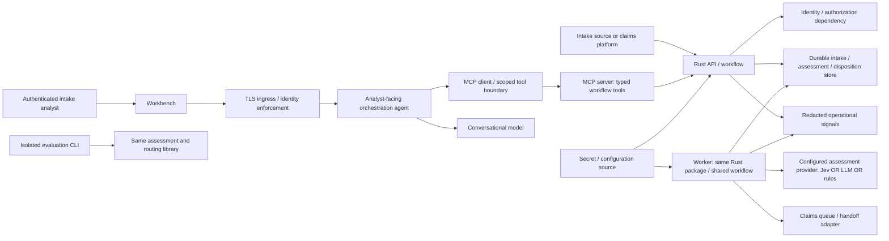
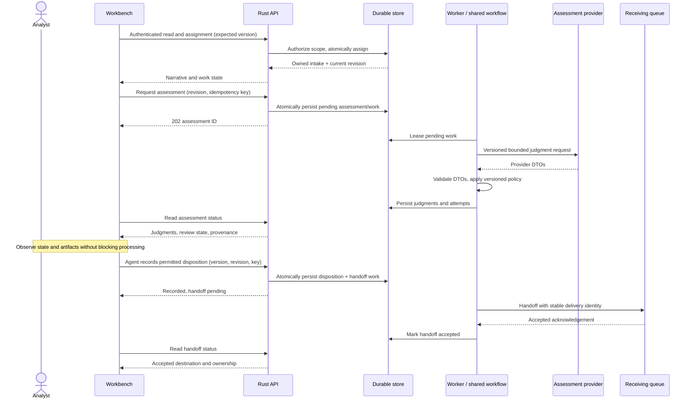
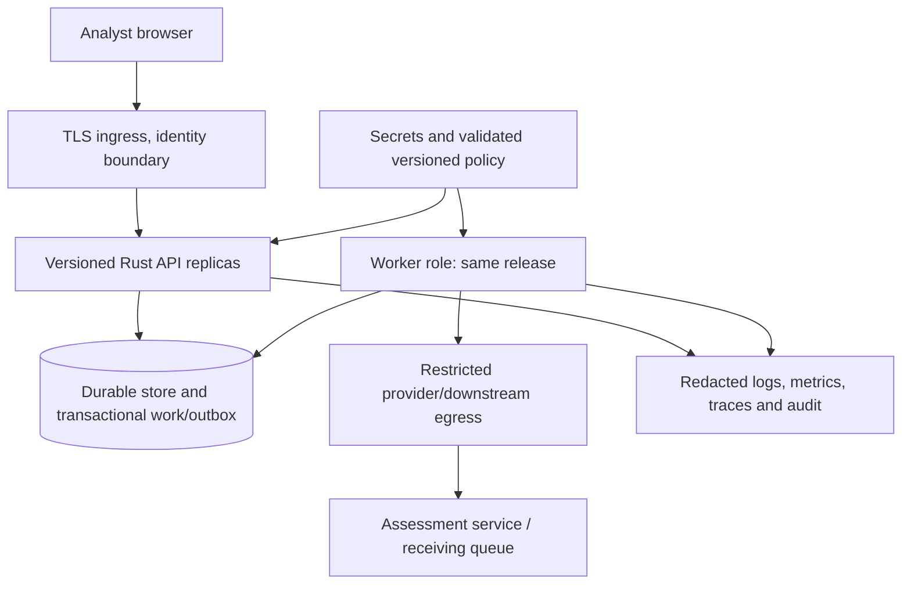

# Intake workbench: first-level system design

Status: Proposed for review, not an implementation or deployment authorization.
Date: 2026-10-05.
Companion: [product problem, journey, and value map](product-spec.md).

## Boundary and assumptions

Current implementation: loopback-only Axum health endpoint and four route tests.
Accepted sample architecture: one Rust package with shared workflow, API and
evaluation CLI; see [ADR 0007](adr/0007-single-package-api-and-evaluation.md).
No claim contracts, database, identity integration, worker, UI backend connection,
or downstream handoff exists.

This document proposes a production-shaped reference design to expose missing
decisions. It does not select a cloud, database vendor, claims platform, or
identity provider. Persistence, background work, and an analyst frontend extend
the starting architecture: they require requirements approval and a new ADR
before implementation, not silent supersession of ADR 0007.

The user clarified that the intended experience is agentic. The workbench is a
surface for an analyst-facing orchestration agent, not merely a form. Agent
platform, conversational model, delegated authority, and protocol versions are
not selected. Jev is a bounded assessment dependency, not the conversation or
workflow authority. Agent requests do not replace deterministic authorization,
validated workflow transitions, or explicit analyst consent.

User-directed product mode: autonomous intake-to-handoff, human intervention by
exception, continuously inspectable state/lineage/artifacts. Exact delegated
actions, thresholds and deployment authority remain undecided. Model comparison stays in the isolated
evaluation runner; production does not send each intake to all three providers.
Use synthetic inputs until data rights, classification, residency, retention,
vendor terms, and account permissions are reviewed.

## System context and dependency boundaries



Arrows denote calls/data dependencies, not unrestricted network permission.
Evaluation uses synthetic fixtures and separate output artifacts, not production
records or human-review credentials. Domain/routing imports no transport/storage
SDKs. API and worker orchestrate through ports; adapters own vendor DTOs and
external failures. Logical worker does not require a separate microservice:
propose a role of the same deployable package only if background work is approved.

| Dependency / owner to assign | Contract and failure boundary |
| --- | --- |
| Intake source, insurer integration owner | Source ID, revision, narrative; deduplicate by source/revision; invalid input returns explicit error, not a fabricated claim |
| Identity, platform owner | Authenticated principal and allowed intake/tenant scope; API enforces object-level authorization even behind ingress; invalid/unavailable identity fails closed |
| Durable store, application/platform owner | Atomic versions, decisions, and pending work; no success acknowledgement before commit; store failure makes write unavailable |
| Assessment provider, model integration owner | Bounded request/response, required judgments and model provenance; timeout/rate-limit/invalid data become typed assessment failures |
| Downstream claims queue, operations/integration owner | Stable handoff ID, acknowledgement/rejection and reconciliation; timeout is unknown delivery, not success or safe-to-repeat proof |
| Secrets/configuration, platform owner | Startup-validated settings and least-privilege credentials; missing/invalid configuration blocks readiness |
| Observability, service owner | Bounded labels and no raw narratives; exporter failure visibly degrades monitoring, never changes disposition |

Concrete named owners and SLAs are review prerequisites for deployment.

## Agent and MCP boundaries

The analyst describes a task, reviews proposed next actions, supplies clarification,
and resolves exceptions through an agentic workbench. Routine permitted actions
do not require per-step human confirmation. Structured
cards remain authoritative views of persisted state; chat text is not a receipt
for recording or delivery. The orchestration agent can select approved tools and
explain their results, but cannot invent assessment results, authorize itself,
or bypass Rust state transitions.

| Boundary | Responsibility and proposed contract |
| --- | --- |
| Browser to agent session | Authenticate user, scope conversation to authorized work, bind session to principal; structured commands/confirmations alongside user text |
| Agent to conversational model | Minimal authorized context and explicit tool schemas; model emits proposed tool calls, not executable authority; model/version recorded |
| MCP client to workflow MCP server | Negotiated MCP capabilities and version; JSON-RPC tool calls over an authenticated transport; typed inputs/results and resource-scoped authorization on every call |
| Workflow tools to Rust API | Validated domain commands using the same workflow as HTTP/evaluation; avoid a parallel policy implementation in prompts/MCP |
| Rust assessment adapter to Jev | Provider-specific HTTP request/response; validated Choice/Noul/Score as required by rubric, no assumption that Jev speaks MCP |
| Orchestrator to another agent, if needed | Explicit delegated task/result contract and restricted identity; not an implicit MCP capability or shared omnipotent session |

MCP is a tool/resource interoperability boundary, not an agent-to-agent message
protocol or an authorization policy. No additional agent is justified yet:
prefer one orchestrator and narrow tools. If external agents become necessary,
choose an agent protocol after defining their responsibilities and trust boundary;
do not label arbitrary agent messages "MCP".

Proposed tools: `get_intake`, `list_work`, `request_assessment`,
`get_assessment`, `request_clarification`, `record_disposition`, and
`get_handoff`. Assignment/input-revision tools are also required if owned by
this product rather than the upstream platform. Tool availability is not
permission. Minimize narrative-bearing resources; no unrestricted SQL,
filesystem, arbitrary URL fetch, or generic "execute" tool.

Read tools and write tools have separate scopes. Proposed initial authority:
agent may retrieve authorized intake and request assessment; routine recording and permitted handoff may execute under predelegated,
server-enforced authority. Exceptions outside those bounds pause for the
appropriate human. Actual action scopes and messaging permission remain proposals. Approval binds the authenticated
actor to the exact resource revision, structured action and payload digest,
expiry, and one-time intent ID. Changing arguments after confirmation requires
new confirmation. The server validates the approval, not an LLM-generated
`approved: true` flag.

### Identity propagation and security

Use two distinguishable identities: the analyst who delegates and the service
that executes. Verify issuer, audience, expiry, and permitted scopes at each
boundary; derive tenant/record access from verified claims and server policy,
never user-supplied IDs alone. Apply authorization when fetching context, invoking
tools, and retrieving results.

Do not pass a browser bearer token to the model or forward it unchanged to every
MCP server. Obtain audience-bound downstream credentials using an approved
delegation/token-exchange flow where supported. Otherwise use narrow service
credentials with server-verified actor/approval context; never manufacture
delegation claims. Concrete identity provider, exchange mechanism, and MCP auth
profile must be selected and tested before integration.

Background work uses a bounded service identity and persisted verified initiating
actor/intent, not an expired user session token. Define revocation and reauthorization
rules for delayed work; reject expired approval before new consequential actions.
Audit user, agent/service, delegated scope, tool, resource/revision, intent,
result, and policy/model versions without logging tokens or narrative content.

Untrusted narratives, tool descriptions/results, and other agents' messages can
contain prompt injection. Treat them as data, isolate instructions, allowlist
servers/tools/egress, validate schemas and result provenance, and enforce
authorization and approval outside the model. Returned links/instructions cannot
grant tool access. Redact sensitive context before model calls; retention and
training terms for the conversational model need review as well as Jev's.
Session memory must not cross users/tenants or become an unauthorized data store.

Use TLS for remote transports, exact approved endpoints, bounded payloads,
deadlines, cancellation, and tool-call/conversation budgets. Credential or
authorization failures fail closed; a model/tool failure can offer authorized
manual handling but cannot acquire more privileges. Test cross-tenant access,
audience mismatch, forged/replayed approval, changed arguments, resource injection,
and sensitive-data exposure in agent/tool integration tests.

### Message and model contracts

Application envelopes are distinct from MCP JSON-RPC envelopes. An MCP request
uses negotiated protocol methods such as `tools/call`, a request `id`, tool
`name`, and schema-validated `arguments`. Do not attach fabricated identity fields
to that protocol as a substitute for authenticated transport.
Tool results use declared structured output where supported by the selected
protocol/SDK; distinguish protocol errors, tool errors, and domain outcomes.
A successfully read failed-assessment resource is not a tool transport failure.

Proposed application intent envelope:

```json
{
  "schema_version": "1",
  "intent_id": "opaque-intent-id",
  "correlation_id": "opaque-trace-id",
  "conversation_id": "opaque-session-id",
  "operation": "record_disposition",
  "resource": {"intake_id": "opaque-id", "input_revision": "r3"},
  "expected_version": 7,
  "idempotency_key": "opaque-scoped-key",
  "arguments": {
    "category": "glass_damage",
    "attention": "standard",
    "review_required": false,
    "target_queue": "approved-queue-id"
  },
  "approval_reference": "server-issued-one-time-reference"
}
```

This illustrates fields, not a frozen API schema. Authenticated identity is
transport/server context, not the envelope. Reject unknown operations, invalid
enums, stale revisions and out-of-scope destinations.
Results reference the intent, resource revision and durable outcome:
`recorded` with disposition/handoff IDs, `conflict`, `validation_failed`,
`authorization_denied`, or `dependency_unavailable`. No free-form "done" message
can replace these results. Model-generated explanations must not override them.

Add logical records to the data model: `AgentSession` (authorized principal,
scope, retention), `ActionIntent` (typed command, approval/version/expiry),
`ToolInvocation` (server/tool/version, identities, intent, bounded attempts and
outcome), and `ModelInvocation` (provider/model/prompt version, usage and outcome).
Store minimal redacted audit metadata; conversation content needs separate
approved retention/access controls.

The conversational LLM performs interaction and tool selection. Jev performs
bounded judgments. Rust owns authorization, exact calculations, state, validation,
and routing policy. The evaluation LLM is a comparator; it is not automatically
the orchestration model. Select and pin each role independently. An extra
conversation layer changes end-to-end latency/cost, so measure its overhead
separately from the fair rules/Jev/LLM assessment comparison.

```mermaid
sequenceDiagram
    actor Analyst
    participant Agent as Workbench agent
    participant Model as Conversational LLM
    participant MCP as Authorized MCP tool server
    participant API as Rust workflow
    participant Jev as Assessment provider
    Analyst->>Agent: Review this authorized intake
    Agent->>Model: Scoped context + approved tool schemas
    Model-->>Agent: Proposed request_assessment call
    Agent->>MCP: Authenticated tools/call with revision and intent
    MCP->>MCP: Validate identity, scopes, resource and arguments
    MCP->>API: Validated assessment command
    API->>Jev: Bounded versioned judgments (worker details below)
    Jev-->>API: Provider output
    API->>API: Validate and apply routing policy
    API-->>MCP: Assessment ID and structured state
    MCP-->>Agent: Typed result, not disposition authority
    Agent-->>Analyst: Assessment card and proposed next action
    Note over Agent,Analyst: Human intervenes only if policy blocks routine action
    Agent->>MCP: Record intent with scoped delegation or exception approval
    MCP->>API: Authorize versioned command and delegated bounds
    API-->>MCP: Durable disposition + pending handoff
    MCP-->>Agent: Structured recorded result
    Agent-->>Analyst: Recorded; delivery still pending
```

This diagram collapses asynchronous assessment scheduling/polling for readability;
the durable success/failure diagrams below remain authoritative for that proposal.
Denial/replay/conflict returns a typed rejection; no tool retry or agent delegation
may bypass it. Show it to the analyst with an actionable, non-sensitive reason.

## Proposed data model

These are logical entities, not a frozen database schema or Rust/API DTOs.
Use opaque IDs, UTC timestamps, explicit schema versions, and version checks.
Narrative revisions are immutable; human corrections do not overwrite model
output. Separate incident category `other` from insufficient/unclear evidence:
uncertainty belongs in review status/reasons, not a forced incident category.
Final labeling rubric and queue taxonomy still need approval.

| Entity | Proposed fields and invariants |
| --- | --- |
| Intake | `id`, source/revision identity, access scope, received time, current narrative revision, owner, work state, record version; creation deduplication is scoped to source |
| NarrativeRevision | Intake ID, revision ID, narrative, supplied facts, author/source, created time; exact assessment input identified by revision; sensitive content excluded from ordinary logs |
| Assessment | ID, intake/input revision, status, provider/model/rubric/policy versions, attempts/duration; tagged outcome: valid judgments OR typed technical failure, never both |
| ValidJudgments | Optional category if unresolved, urgent cue, review-required flag/reason codes, provider-specific uncertainty evidence; no universal confidence conversion |
| AssessmentAttempt | Assessment ID, attempt index, sanitized error/status, duration, usage if available; preserves timeout/invalid-output costs without raw responses in telemetry |
| Disposition | ID, intake/revision/version, assessment ID if used, actor, category or unresolved state, standard/expedited attention, review reasons, target queue if routable, time; accepted/corrected/manual origin |
| Clarification | ID, intake, requesting actor, needed facts, owner/status, answer revision; approved answer creates new narrative revision and invalidates stale assessments |
| Handoff | ID, disposition ID, destination, pending/accepted/rejected/unknown state, attempts, acknowledgement; delivered only after destination confirmation |
| AuditEvent | Actor/service, entity/version, action, time, correlation, result; append-only access-controlled history, sensitive content governed separately |

Relations: intake has many revisions/assessments/dispositions; each assessment
references one input revision; each disposition references its source revision
and optionally an assessment; handoff references a disposition. New revisions
invalidate old suggestions for new decisions but preserve history.

Use separate state axes: work (`unassigned`, `owned`, `awaiting_clarification`,
`handoff_pending`, `handed_off`), assessment (`pending`, `completed`, `failed`,
`superseded`), and handoff status. A failed assessment can have a valid manual
disposition. "Recorded" does not mean "handed off".
Which states close an intake or allow reopening remains a product decision.

## Proposed exposed contracts

Authenticated versioned JSON API. Identity comes from verified auth, not a body
field claiming an actor/tenant. IDs must not disclose access scope; enforce access
on reads and writes. Request limits, enumeration values, timestamps, and error
schemas require an OpenAPI contract after design review.

| Endpoint proposal | Input / output and semantics |
| --- | --- |
| `POST /v1/intakes` | Source identity and narrative -> persisted intake ID/version; 201 new, replay returns original result; same key with different input -> 409 |
| `GET /v1/intakes` | Authorized queue/filter and cursor -> bounded paginated work items; no global narrative dump |
| `GET /v1/intakes/{id}` | Intake, current input revision, assessment/disposition/handoff states; distinguish unavailable assessment from missing intake |
| `POST /v1/intakes/{id}/assignments` | Expected version and assignment -> owned intake; stale/competing assignment -> 409 |
| `POST /v1/intakes/{id}/assessments` | Input revision and idempotency key -> 202 with assessment ID/status URL after durable scheduling; invalid/stale revision -> 409/422 |
| `GET /v1/assessments/{id}` | Pending/completed/failed tagged result; completed resource retrieval may be 200 with failed assessment, never a successful judgment payload |
| `POST /v1/intakes/{id}/clarifications` | Expected version, required facts and owner -> clarification record; not an authorization to send messages to a claimant |
| `POST /v1/intakes/{id}/revisions` | Expected version and clarified input -> new revision; invalidates stale assessment use |
| `POST /v1/intakes/{id}/dispositions` | Expected version, source revision, edited disposition and optional assessment reference -> 201 durably recorded decision + handoff/review state; stale reference -> 409 |
| `GET /v1/handoffs/{id}` | Pending/accepted/rejected/unknown, sanitized reason and recovery owner; cannot infer delivery from local record |

Proposed errors: `code`, safe `message`, correlation ID, retry eligibility,
field errors when appropriate. 401 unauthenticated; 403 denied (or consistent
404 anti-enumeration policy to decide); 422 invalid input; 409 conflicts;
429 admission limit; 503 unavailable dependency. No narrative/secret leakage.
Client timeout means unknown write outcome: retry with the same scoped key or
read status. Persist key/request identity/result atomically; define expiry before
implementation. Durable decisions require expected-version checks even with
idempotency. No unchecked overwrite or exactly-once-delivery claim.

## Successful autonomous journey



User-visible assessment latency is from request to usable result, including
scheduling, attempts, and polling; asynchronous 202 does not satisfy the two-second
target by itself. Handoff latency is a separate metric. No intermediate status
may be silently omitted from attempted-intake denominators.

## Failure, clarification, and recovery

```mermaid
sequenceDiagram
    actor Analyst
    participant UI
    participant API
    participant DB
    participant W as Worker
    participant P as Provider
    participant Q as Receiving queue
    W->>P: Assess with bounded attempts/deadline
    alt Timeout or invalid output
        W->>DB: Persist failed assessment and failure reason
        UI->>API: Read status
        API-->>UI: Technical failure, manual review action
        Analyst->>UI: Record manual disposition
    else Valid but ambiguous
        W->>DB: Persist valid judgments + review requirement
        UI->>API: Create owned clarification
        API->>DB: Persist clarification
        Analyst->>UI: Supply clarified input
        UI->>API: Submit new revision (expected version)
        API->>DB: Save revision; supersede stale suggestions
    end
    UI->>API: Record disposition with expected version
    alt Stale concurrent edit
        API-->>UI: 409, refresh and reconcile; no overwrite
    else Current input and version
        API->>DB: Commit disposition + pending handoff
        API-->>UI: Recorded, not yet delivered
        W->>Q: Deliver with stable handoff identity
        alt Destination rejects
            Q-->>W: Rejection
            W->>DB: Persist rejected state and recovery owner
        else Delivery timeout
            W->>DB: Persist unknown state
            W->>Q: Query/reconcile by handoff identity
            Note over W,Q: Retry only under agreed duplicate-safety contract
        end
    end
```

Store outage prevents safe recording/scheduling: API returns unavailable, keeps
the draft visible, and never claims a durable decision. Worker leases expire
after crash; retries have bounded budgets and stable identities. If the
destination cannot deduplicate or report delivery status, ambiguous delivery
requires human reconciliation instead of blind retries.

## Production deployment reference, not a selected platform



Propose transactional store-backed work/outbox rather than a broker until
throughput or delivery requirements justify one. No database/broker added now.
API replicas are stateless outside the store; worker lease and version controls
prevent concurrent processing from corrupting state. Process restarts must not
erase pending handoffs. Provider choice/configuration is deployment-controlled,
not an untrusted UI field.

Production prerequisites: named environment/owners; access/egress and retention
approval; migrations and recovery/backup tests; validated concurrency/input/output,
queue/polling, deadline/retry/rate limits; secret rotation; audit access controls;
load and failure testing; health/readiness semantics; metrics/alert ownership;
release identity and rollback compatibility. Readiness reflects necessary local
configuration/store availability, not a provider call on every probe. Provider
outages should preserve authorized manual work where store availability permits.

The current `/health` is liveness only. It is not proof this production topology
is ready. Define graceful draining and unfinished-work recovery before deployment.

## Evidence and approval gate

| Before accepting | Required evidence |
| --- | --- |
| Product journey | Five stories reach accountable handoff or an explicitly owned exception; reviewed value hypotheses and countermetrics |
| Contracts/model | Approved rubric, queue taxonomy, revision/state transitions, idempotency/error/access semantics; OpenAPI examples and boundary tests |
| Provider adapters | Wiremock request/response/failure tests plus provenance; no paid calls in ordinary tests |
| Durable workflow | Crash/retry, duplicate, stale-write and rejected/unknown handoff integration tests |
| Production release | Environment-specific infrastructure/security/dependency ADRs, operational limits and recovery evidence, named authorization |

Decisions to resolve first: autonomous action bounds and exception policy; actual
receiving queue and acknowledgement contract; intake source and required fields;
clarification ownership/channel; queue/reason taxonomy; data classification and
retention; synchronous versus proposed durable asynchronous assessment tradeoff.
Then decide the minimum sample fidelity needed to validate customer value before
selecting production infrastructure. This reference is not a request to build
every dependency.
Also resolve agent authority/confirmation points, host and model roles, MCP
transport/version/auth profile, delegation mechanism, conversation memory and
retention, tool schemas/error mapping, and any genuine agent-to-agent need.

## Next design artifact: executable Rust contracts

The user requested a contract-only milestone after design approval: make the
proposed data and control flow inspectable in Rust before business implementation.
Introduce only agreed request/result DTOs, domain command/outcome types, and
example JSON. Include serialization and rejection tests so contracts compile
and document exact shapes. Do not add placeholder HTTP/MCP handlers returning
success, empty services, or `todo!()` execution paths.

Show the boundary path: untrusted API/tool arguments -> structural and semantic
validation -> server-verified identity/approval context -> domain command ->
typed outcome -> sanitized API/tool result. Distinguish request fields from
controls derived or verified by the server; merely defining an approval-reference
type does not enforce approval. Identify which checks belong at each stage and
which remain unimplemented.

Cover revisions/expected versions, scoped idempotency, action intent/approval,
assessment judgments versus technical failure, disposition versus handoff state,
and explicit errors for the approved slice. Keep provider DTOs distinct from
public API types. MCP SDK protocol envelopes are not a second handwritten
protocol model. Publish paired JSON examples and an API schema when the schema
generation approach is selected. Review these artifacts before wiring handlers,
storage, providers, or agent execution.
