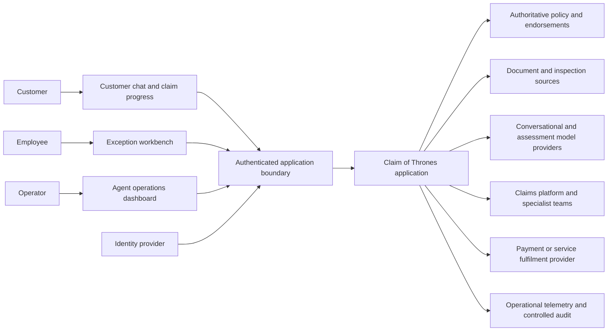
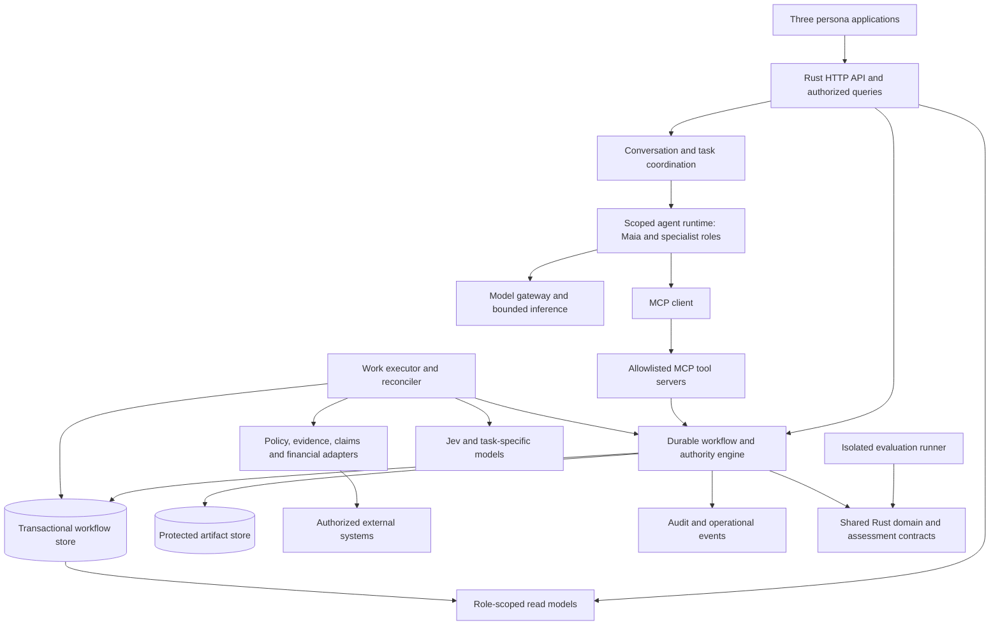
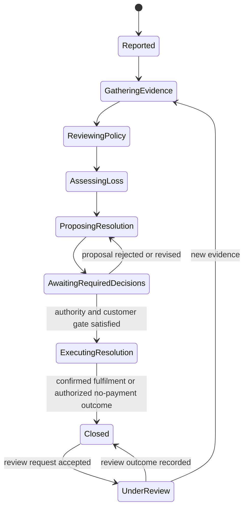
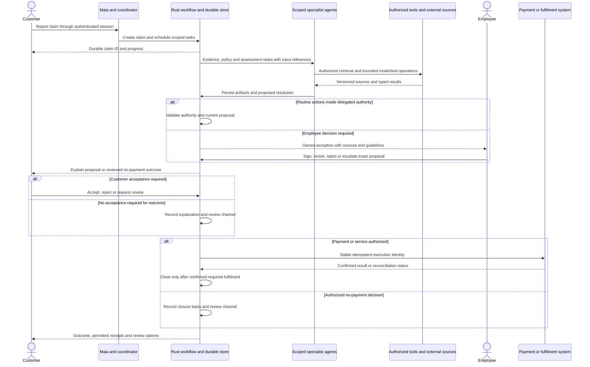
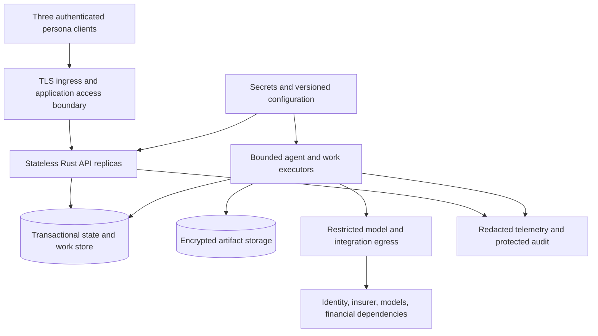

# Claim of Thrones system architecture

Status: proposed architecture for design review.
Date: 2026-10-05.
Inputs: [product vision](product-spec.md),
[persona journeys](persona-journeys.md), and
[interactive design](design/intake-workbench.html).

Product acceptance is defined by the proposed R01-R15 requirements and S01-S12
scenarios, with M01-M14 measuring quality, total effort and insurer/vendor value.
The synthetic motor reference journey and holistic scorecard remain proposals;
this architecture does not approve their scope, targets or consequential actions.

## 1. Purpose and architectural scope

Claim of Thrones services an insurance claim from customer report through evidence
collection, policy review, loss assessment, resolution, authorized payment or
service fulfilment, and explained closure. Autonomous agents perform permitted
work; customers and employees intervene when a defined gate requires them.
Operators observe and manage execution without acquiring claims decision authority.

The architecture must support three experiences:

| Experience | System responsibility |
| --- | --- |
| Customer conversation | Report a claim, follow progress, supply evidence, respond to proposals, receive receipts and request review |
| Employee workbench | Resolve assigned exceptions using customer context, source evidence, current guidelines and verified authority |
| Operator dashboard | Inspect fleet/run states, dependencies and lineage; coordinate authorized recovery; measure quality and economics |

The executable sample implements a React UI, local Rust servicing coordinator,
keyword/Jev intent assessment, review-only task planning and process-local
operator inspection. See [ADR 0010](adr/0010-react-ui-and-rust-agent-boundary.md)
for implemented boundaries and [README](../README.md) for runnable commands.
The original HTML design still simulates full claims workflows.
This target architecture is not deployment authorization or approval of
autonomous financial decisions. Supported claim types, jurisdiction, legal
authority and action limits must be agreed before implementation.

The accepted [single-package ADR](adr/0007-single-package-api-and-evaluation.md)
provides the Rust foundation. Durable storage, agent execution, background work
and external financial integration require new decisions/ADRs before they are
introduced. Logical components below do not imply separate microservices.

## 2. Architectural principles

- **One authoritative workflow.** Durable state and deterministic Rust transition
  rules determine what happened and what may happen next. Chat and model output
  cannot overwrite them.
- **Autonomy inside delegated bounds.** Each action requires identity, resource
  access, permitted scope, current revisions and any required decision/consent.
  Routine work proceeds without repeated human clicks.
- **Evidence before consequence.** Decisions reference authoritative policy and
  versioned evidence. Probability or a fluent explanation is not authority.
- **Recovery is part of the workflow.** Exceptions have an owner and resume
  condition. Unknown external outcomes require reconciliation, not blind retry.
- **Inspectable but least-privileged.** Customers see safe claim status/explanations;
  employees see authorized case evidence; operators see scoped execution metadata.
- **Model roles are independent.** Choose models for tasks, not an entire agent
  fleet by default. Evaluate component quality separately from full-claim outcomes.

## 3. System context



Claim of Thrones is authoritative for its workflow, intents and artifact references.
The insurer remains authoritative for policy, eligibility/decision authority and
claims records as assigned by integration contracts. Payment/fulfilment systems
are authoritative for external execution confirmations.
Synchronize external identifiers and revisions; do not silently maintain two
conflicting sources of truth.

## 4. Logical components and execution architecture



| Component | Responsibility and boundary |
| --- | --- |
| HTTP API | Authenticate, authorize resource access, validate boundary DTOs, accept commands and return persisted results/query views |
| Conversation coordinator | Bind sessions to principals/claims, retrieve minimal context, present structured results and route customer/employee responses |
| Agent runtime | Execute scoped tasks with deadlines, allowed tools, artifact inputs and typed outcomes; persist checkpoints rather than rely on model memory |
| Workflow/authority engine | Validate state transitions, revisions, delegation, approvals, customer responses and financial limits; schedule eligible work atomically |
| MCP tool layer | Expose narrow typed operations backed by the same workflow rules as HTTP; no duplicate business policy in prompts |
| Work executor/reconciler | Lease durable work, call adapters, enforce budgets, record attempts, reconcile uncertain external outcomes and recover after crash |
| Stores/read models | Persist state/decisions/work, protect documents, serve authorized persona projections and fleet aggregates |
| Model/adapters | Own vendor formats, bounded calls, validation and typed failure translation; model output enters as untrusted data |
| Audit/measurement | Preserve action provenance and collect redacted operational signals with defined units/windows/denominators |

Start with a modular Rust application and shared domain library. API, execution
and reconciliation may be runtime roles of one release. A transactional work
queue/outbox is the proposed initial scheduling mechanism; add a broker or
separate service only for demonstrated scale/isolation requirements.
Domain code imports no transport, database or provider SDKs.

### Browser and agent execution boundary

The approved frontend is TypeScript/React. It submits customer messages and typed
employee/operator commands to the Rust API and renders role-scoped results.
It holds no provider credentials, constructs no provider questions and does not
invoke Jev/MCP servers directly. In the local comparison sample, users select
configured assessor IDs; the browser submits the same message separately and
concurrently for each selected assessor. This is a comparison control, not the
target claims product's model-allocation policy. Rust validates selection and
coordinates execution. The sample exposes provider identity in comparison
results; raw exchanges require operator authentication. Target customer responses
describe work and outcomes without provider-specific fields.
The implemented Rust path follows
[ADR 0011](adr/0011-provider-port-and-servicing-use-case.md): HTTP maps transport,
`ServicingService` coordinates execution through an injected `Assessor`, adapters
produce validated domain evidence, and an injected routing policy prepares tasks.
Available provider implementations are wired in the composition root; the
sample's per-request selection follows
[ADR 0013](adr/0013-provider-comparison-and-authenticated-inspection.md).
Policy thresholds live in
validated versioned configuration, not provider code or prompts.

### Customer and policy MCP boundaries

Expose customer context and policy capabilities through separate logical MCP
servers with independently scoped access. They may initially run in the same
Rust application; separate contracts do not require separate deployments.

| Boundary | Sample implementation | Future source adapter |
| --- | --- | --- |
| Customer context MCP | Synthetic customer/profile and policy associations, resolved from the authenticated principal | Authorized customer system using verified login-to-customer mapping |
| Policy MCP | Versioned synthetic policy fixtures, cited clauses and deterministic rule evaluation | Customer-specific policy/endorsement sources and access-filtered document retrieval (RAG) |

Agents use these contracts rather than embed customer records or policy rules in
prompts. Replacing fixtures with real sources changes adapters, not the agent's
authority or workflow invariants. Source provenance and failure semantics remain
mandatory in both implementations.

RAG retrieves evidence; it does not become the policy decision authority.
Separate retrieval of applicable clauses from evaluation of supported structured
rules and from authorization of consequential actions. Policy documents may
require interpretation that cannot safely become an automatic rule: missing,
conflicting or unsupported evidence produces an explicit review-required outcome,
not an invented entitlement. Retrieval failure remains a technical failure.

Policy results identify policy/endorsement version, effective context, document
and clause references, and retrieval/rule versions where applicable. An evaluation
records the exact evidence used so a later document or index update cannot silently
change the basis of an existing decision.

## 5. Agent responsibilities and model allocation

| Logical agent | Task / inputs -> outputs | Authority and model role |
| --- | --- | --- |
| Servicing / Maia | Customer conversation and claim state -> scoped tasks, status explanations, requests for intervention | Conversational LLM proposed; cannot approve coverage/payment or invent completion |
| Evidence | Authorized sources and required facts -> provenance-bearing evidence bundle and identified gaps | Extraction/document model where needed; retrieved content is not instruction or ground truth |
| Policy | Policy snapshot and evidence -> supported policy analysis and required decision gate | Deterministic policy checks and authorized judgement; model assistance does not establish entitlement |
| Assessment | Incident/evidence and inspection -> bounded judgments and supported loss calculation | Jev candidate for category/urgency/ambiguity; other task-specific models as justified; amounts computed deterministically |
| Resolution | Reviewed policy/assessment -> versioned offer or explained no-payment proposal | Model-assisted explanation; authority/consent evaluated outside model |
| Payment/fulfilment | Authorized resolution -> instruction, external status and reconciliation result | Deterministic scoped tools; no model discretion over recipient, amount or retry safety |

An agent role can have many run instances. Fleet counts group runs by role,
version, environment and execution state; a single role badge is not a workload
model. Agents do not freely delegate authority to one another.
Maia's dependency plan is represented by durable tasks, not arbitrary peer chat.

Jev is called through its documented HTTP contract; it is not assumed to be an
MCP server. Validate required answer IDs, labels, numerical bounds and
distributions. Preserve provider-specific uncertainty without pretending that
Jev probabilities and LLM self-reported confidence are equivalent.
Pin provider/model/prompt/rubric/policy versions.

The existing rules/Jev/structured-LLM comparison design is an intake component benchmark.
It does not evaluate coverage, valuations, payment authority or end-to-end claims.
Use separate full-journey evaluation and measure orchestration latency/cost.
Ordinary tests use synthetic fixtures and mocks, never paid inference.

## 6. State, persistence and data ownership

The claim aggregate contains lifecycle and record version, not all documents or
model transcripts. Logical records below are design inputs, not a frozen schema.
Use opaque IDs, UTC times, explicit versions and access scope.

| Record | Essential fields / invariant |
| --- | --- |
| Claim | Insurer/source ID, customer/policy association, lifecycle, owner, current revision, aggregate version; deduplicated creation |
| InputRevision / EvidenceArtifact | Immutable source, revision, author, content reference, integrity/provenance and classification; corrections append |
| PolicySnapshot / Guideline | Authoritative source/version/effective context and controlled content reference; changing sources invalidates affected conclusions |
| Assessment / Attempt | Input references, typed valid judgments OR technical failure, model/rubric versions, attempts/usage/duration; manual correction retains original |
| CoverageDetermination / LossAssessment | Referenced sources, basis/reasons, calculation/authority and amounts/currency; no unsupported conclusion from model prose |
| ResolutionProposal | Versioned outcome/amount/service, basis and review requirements; changes invalidate applicable prior decisions/responses |
| AuthorityDecision / CustomerResponse | Distinct actors, exact proposal digest/version, scope, time/expiry and outcome; acknowledgement is not waiver |
| Exception / Assignment | Reason, owner, required action, blocked task/revision, escalation and resume condition; ownership conflicts are explicit |
| AgentRun / DelegatedTask | Role/version, parent task, claim/input references, scope/budget, checkpoint/state and typed outcome |
| ActionIntent / Invocation | Operation, resource/version, idempotency identity, verified authority references, model/tool attempts and result |
| PaymentOrServiceInstruction / Receipt | Stable execution identity, authorized recipient/amount/service, pending/unknown/failed/confirmed status and external reference |
| Closure / ReviewRequest | Explained outcome, completion evidence, review/reopen owner and links to earlier decisions; history is retained |
| AuditEvent | Initiating/executing identities, delegation/action, artifact references, versions, timestamp/correlation and result; no credentials |



Exceptions are an orthogonal blocking state on tasks, not a forced lifecycle
advance. Task states include queued/running/waiting-for-customer/
waiting-for-employee/reconciling/completed/failed/cancelled.
Financial state distinguishes not-applicable, not-authorized, pending, unknown,
failed and confirmed. A claim is not closed while required execution is unknown.
No-payment closure needs an authorized, explained decision and review channel,
not coerced customer acceptance.

Atomic writes commit state/version, intent result, audit and pending work.
Lease/optimistic-version controls prevent competing owners from corrupting state.
Financial action gates are checked again immediately before execution.
Outbox delivery may be at-least-once; recipient deduplication and reconciliation
contracts are mandatory where repeated delivery is possible. No exactly-once claim.

## 7. Public API, MCP and delegated-task contracts

Expose authenticated `/v1` JSON contracts with bounded payloads, strict schemas,
safe errors, cursor pagination and expected-version writes. These endpoint
families are proposed; OpenAPI and Rust DTO/domain types follow design approval.

| API family | Commands and queries |
| --- | --- |
| Claims and conversation | Create/read authorized claim, submit message, resume session, read structured progress |
| Evidence and clarification | Authorized upload/source attachment, request/respond to clarification, read permitted artifact metadata |
| Exceptions and assignments | List authorized work, acquire/transfer ownership, submit typed intervention and query gate state |
| Decisions and resolution | Request/read assessments, propose/revise resolution, record authority decision, accept/reject/request review as customer |
| Financial fulfilment and closure | Request permitted execution, read status/receipt, reconcile through restricted controls, request review/reopening |
| Agent operations | Scoped fleet/run/lineage queries, explicit pause/retry/reassignment commands, versioned metric queries |

HTTP creation returns a durable resource identity. Asynchronous work returns
202 with status location only after durable scheduling. Reading a failed
assessment can return 200 with a tagged failed resource; it must not look like
valid judgments. State conflicts return 409; invalid semantic input 422;
unauthenticated 401; denied access 403 or consistent anti-enumeration 404;
admission limits 429; dependency unavailability 503.
Choose one denied-resource policy before contracts.

MCP exposes allowlisted tools such as `get_claim`, `request_assessment`,
`submit_intervention`, `record_resolution_decision` and `get_run_lineage`.
Tool calls use the negotiated MCP protocol/SDK and declared schemas over an
authenticated transport. MCP is not identity policy or an agent-to-agent
protocol. Distinguish JSON-RPC errors, tool execution errors and domain outcomes.
Do not expose arbitrary SQL, shell, filesystem or unrestricted URL tools.

Customer-context tools include `get_current_customer` and authorized
`get_customer_context`. Resolve the current customer from verified server-side
identity, not a customer ID asserted in chat. Employee lookups by customer ID
require explicit tenant/resource/assignment authorization; possession of an ID
is not permission. Return only the fields needed for the delegated task.

Policy tools include `get_policy_snapshot`, `retrieve_policy_clauses` and
`evaluate_policy_rules`. Retrieval is constrained to authorized customer policies
and applicable versions before results reach the agent. Rule evaluation returns
structured supported findings or explicit review-required/technical-failure
outcomes, with evidence references; it does not authorize settlement.
Read-only context/retrieval access does not grant policy-change or financial
execution permissions.

Agents exchange application task/result envelopes through the durable coordinator.
A separate inter-service agent protocol is needed only if remote agent execution
is selected. Required fields are schema/task/parent IDs, claim/input artifact
versions, requested task, allowed scope/tools, deadline, budget, correlation
and typed result references. Verified authority is server context—not a model
claim inside an envelope.

Example consequential intent, illustrative rather than a frozen schema:

```json
{
  "schema_version": "1",
  "intent_id": "intent-opaque",
  "claim_id": "claim-opaque",
  "expected_version": 12,
  "operation": "execute_resolution",
  "proposal_reference": {"id": "proposal-opaque", "version": 3},
  "authority_reference": "decision-opaque",
  "customer_response_reference": "response-opaque",
  "idempotency_key": "key-opaque",
  "correlation_id": "trace-opaque"
}
```

The server resolves authorized amount/recipient/service from immutable records;
it does not trust model-supplied payment details. Reject changed/expired authority,
stale proposals, wrong roles and key reuse with a different payload.
Responses distinguish recorded/pending, confirmed, conflict, denied, invalid,
failed and unknown; include safe reason codes and correlation.
Client timeout is unknown write outcome: query status or replay the same key.
Key retention/expiry must cover the external retry/reconciliation lifecycle.

## 8. Identity, trust and data protection

Authenticate customers, employees and operators separately. Enforce resource
ownership/assignment, tenant scope and action authorization on every read/write.
Employee status alone does not imply settlement authority; operator monitoring
permission does not permit decisions or payments.

Separate initiating user, delegated agent and executing service identities.
Validate issuer/audience/expiry/scopes, acquire audience-bound downstream
credentials using the selected supported delegation mechanism, and never send
credentials to models or forward browser tokens indiscriminately.
Background work uses scoped service identity with verified initiating intent;
define revocation/revalidation for delayed execution.

Bind required approvals to operation, claim/input/proposal versions, payload
digest, actor scope and expiry; consume appropriately. Changed arguments require
new authority. Customer clarification, insurer authority and customer acceptance
are different control records. Ordinary autonomous work uses approved delegation
rather than fabricated per-step approval.

Treat narratives, documents, MCP descriptions/results and peer output as
untrusted data. Schema validation, least-privilege tools, source provenance,
egress allowlists and server-side gates constrain prompt injection.
Model failures cannot expand privileges or authorize an alternate provider.
Session context is resource-scoped; cross-claim/customer memory is prohibited
unless separately authorized.

Protect artifacts and sensitive conversation content separately from redacted
telemetry. Define data rights, residency, access, retention/deletion, vendor
training/retention terms, encryption and document malware/type/size controls.
Access to lineage must not disclose private claimant evidence through operators'
aggregate dashboards. Audit retrieval and actions; never log tokens or raw
narratives by default.

## 9. End-to-end execution and exception sequences



The workflow exposes progress and authorized artifact views throughout. Models
do not receive all financial credentials or the entire claims database.
Customer rejection keeps resolution work open; it does not fall through to payment.

```mermaid
sequenceDiagram
    participant A as Agent or executor
    participant W as Workflow store and authority engine
    actor H as Required human
    participant X as External dependency
    A->>X: Bounded operation
    alt Missing or conflicting evidence
        A->>W: Owned clarification gate
        W-->>H: Required facts and source context
        H->>W: New evidence revision
        W->>A: Resume affected tasks; supersede stale conclusions
    else Model or tool failure
        A->>W: Typed failure and recorded attempts
        W-->>H: Manual recovery or escalation gate
        H->>W: Authorized intervention on current revision
        W->>A: Resume only if gate satisfied
    else Financial execution timeout
        A->>W: Unknown outcome; block conflicting execution and closure
        A->>X: Query by stable execution identity
        alt External outcome confirmed
            X-->>W: Verified receipt
        else Still unknown
            W-->>H: Payment operations reconciliation
        end
    end
```

Recheck versions and authority after waiting. A process crash cannot erase pending
work; leases/checkpoints support safe recovery. Cancellation does not reverse an
external payment already executed. Store outage makes recording unavailable;
the UI retains an unsent draft, never reports durable success.
Reopening creates review work linked to earlier closure and may invalidate
future actions; it does not erase or automatically reverse financial history.

## 10. Deployment and operational architecture



Cloud/runtime, store vendor, identity provider, agent SDK, MCP version/auth
profile and deployment topology are unresolved selections.
Runtime isolation should match tool/dependency risk; separate model/tool
credentials and execution budgets. Test code receives no production secrets.
Releases identify code, model/prompt/policy/guideline/schema versions.
Migrations and rollback must preserve pending work and financial compatibility.
Backups need tested restore and reconciliation; restoration cannot blindly
reissue already executed instructions.

Configure input/document/response limits, concurrency, task/claim budgets,
deadlines, bounded retries/backoff, lease duration, queue admission, cancellation
and model spend controls before deployment. Provider/financial outages preserve
safe read/exception handling when dependencies permit, not false completion.
The current `/health` is process liveness; readiness and graceful draining need
separate implementation. Do not probe external providers with paid calls.
Numeric SLOs, RPO/RTO, retention, owners and alert thresholds require approval.

## 11. Observability, value and evaluation

Operational signals: task and claim states, queue/wait age by owner, attempts,
dependency/authorization failures, invalid model outputs, deadlines, unknown
financial outcomes, model/tool cost and release provenance.
Correlation IDs join traces/audit but are not metric labels.
Bound dimensions; disclose collection freshness and missing data.
Telemetry degradation is visible and does not change claim decisions.

Customer views expose safe progress; employee views expose authorized evidence
and gates; operator views expose fleet/run state and scoped drill-down.
Projection lag is explicit; commands use authoritative versions, not stale
dashboard state.

Value reporting distinguishes measured outcomes, assumptions and forecasts.
Correct resolved claims per staff-hour includes exception/correction/oversight
effort; cost per correct resolution includes declared labor/model/tool/platform
costs. Pair efficiency with correctness, disputes, payment errors, rework and
customer effort. Capacity value is not realized cash savings. Payment amounts
are not business savings.
Full-claim targets/labels/baselines and study power remain unresolved; existing
intake targets cannot substantiate end-to-end value.

## 12. Journey coverage and design gates

The [persona coverage matrix](persona-journeys.md#architecture-and-contract-coverage-matrix)
is the acceptance checklist for this architecture.

| Scenarios | Requirements | Architectural coverage |
| --- | --- | --- |
| S01 | R01-R07, R10 | Durable receipt, evidence, coverage/valuation, authorized proposal/response, confirmed fulfilment and closure gates |
| S02 | R02, R08, R09 | Evidence provenance, clarification ownership, immutable revisions and reassessment |
| S03 | R01, R08 | Preserved report, urgent/specialist routing, acknowledged handoff and retained ownership |
| S04 | R03, R05, R06, R10 | Reviewable coverage basis, verified decision authority, explained response and recourse |
| S05 | R04-R06, R09 | Deterministic valuation, versioned proposals, distinct authority/customer records and rejection/conflict handling |
| S06 | R03, R05, R06, R10 | Authorized no-payment basis, explanation without coerced agreement and review-preserving closure |
| S07 | R07, R08, R10 | Stable execution identity, containment, reconciliation, cancellation boundaries and closure gates |
| S08 | R07, R09, R10 | Retained history, review ownership, reopening and freshly authorized financial adjustment |
| S09 | R01, R09 | Deduplication, session resume, concurrent-write conflict and write-failure recovery |
| S10 | R02, R08, R09, R11 | Source integrity, typed failures, attempt budgets, manual recovery and actionable dependency signals |
| S11 | R06, R08, R11 | Accessible status/recourse, scoped lineage, freshness/redaction and explicit telemetry gaps |
| S12 | R12-R15 | Comparable quality-adjusted baseline, declared costs/denominators, insurer/vendor viability and no double-counting |

Before Rust contracts, decide supported claims/jurisdiction, authority/action
matrix, identity/delegation, authoritative insurer integration, required evidence,
financial execution/reconciliation, review rights and named exception ownership.
Record consequential choices in ADRs; no target component is implemented by this
document.

Next produce compile-checked boundary DTOs/domain commands/tagged outcomes and
paired JSON examples for the agreed slice—not empty success handlers.
Separate authenticated server context from untrusted request data; derive
OpenAPI/MCP schemas after selecting tooling. Test serialization/rejections first,
then domain state/authority gates, mocked providers, durable crash/conflict/
financial recovery and persona-level end-to-end scenarios.
Use [candidate review and CI](candidate-review.md) for every implementation
candidate. Production approval additionally requires environment-specific
security/data review, dependency contracts, operational/recovery evidence and
named release authority.
